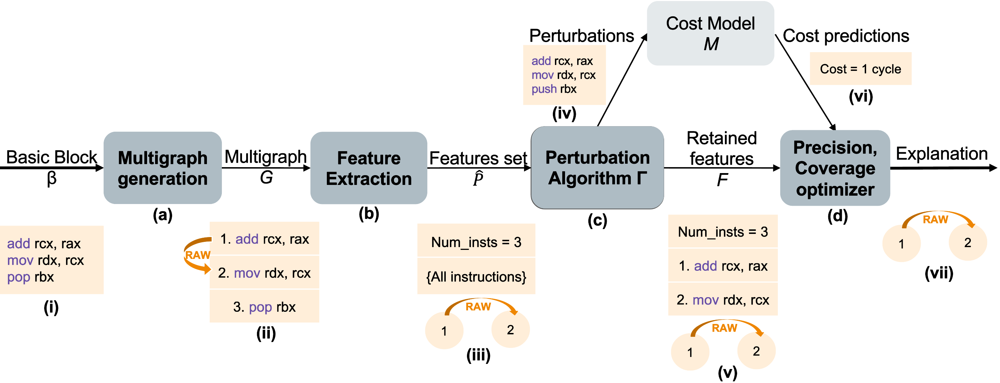

# COMET: COst-Model-ExplanaTions




COMET is a framework for explaining individual performance predictions given by x86 assembly cost models for basic blocks. COMET can be used to identify the features of the input basic block which are important for the throughput prediction made by the cost model being explained. COMET is compatible with any x86 assembly input basic block and is optimized to explain throughput predictions. In this implementation, we provide functionalities to explain the cost models [Ithemal](https://github.com/ithemal/Ithemal) and [uiCA](https://github.com/andreas-abel/uiCA) with COMET. Note that COMET is compatible with other cost models as well, with minor adjustments.  

For more details on COMET's algorithms, please check out our [paper](https://arxiv.org/abs/2302.06836).

The following minimal requirements exist for setting up COMET. 
- Ubuntu OS (the experiments in the paper were conducted on Ubuntu v22.04, so it is recommended to work with a recent distribution of Ubuntu)
- `sudo` access on the machine on which experiments are conducted
- `python, pip, miniconda, cmake` must be installed on the machine
- [LLVM](https://llvm.org/) must be installed on the machine. To install `LLVM`, run `sudo apt install llvm`

Once the above requirements are satisfied, COMET can be setup by running the following commands from the project's root directory. 

```
./scripts/setupcomet.sh
eval "$(conda shell.bash hook)"
conda activate comet
```

This is a one-time installation procedure. When re-running COMET after installation, one should just activate the environment of the project by `conda activate comet` before running any experiments. 

COMET currently explains the following cost models: Ithemal, uiCA, and our crude cost model.

To explain the predictions of any of the above cost models with COMET, run the following command:
`python3 bb_explain.py <code> opcode_dependency_num_insts <cost model> <precision threshold> <seed>`
If the code is intel syntax then please prepend `.intel_syntax noprefix;` to the code. 

The name of the cost models to be used in the above command are:
1. Ithemal - ithemal
2. uiCA - uica
3. crude model - crude

To run COMET over the entire explanation test set (can be found at `data/Ithemal_dataset/explanation_test_set.csv`), please use the following command, with cost model name as shown above:
`python3 scripts/run_comet_full_explanation_test_set.py <cost model> <precision threshold> <seed>`

The explanations obtained from COMET will be stored at the folder: `data/<cost model>_results_seed_<seed>`
